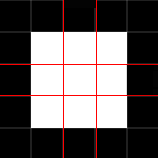

1px border
===
###1. 0.5px
```
.border-1px {
    border: 0.5px solid black;
}
```
ios8下已经支持0.5px了

**实践后发现生效的只有下边框和右边框，左边框和上边框还是被渲染成0px了，可能和系统版本有关** 

###2. border-image
```
.border-1px {
    -webkit-border-image: url("border.png") 2/1px;
}
```


用5×5的的图片可以实现

**缺点：不够灵活，修改色值或者加圆角都比较麻烦**

###3. multiple backgrounds + linear gradient
```
.border-1px {
    background: -webkit-linear-gradient(-90deg, black 0, black 1px, transparent 1px, transparent 2px) no-repeat 0 0/100% 1px,
                -webkit-linear-gradient(90deg, black 0, black 1px, transparent 1px, transparent 2px)  no-repeat 0 100%/100% 1px,
                -webkit-linear-gradient(0, black 0, black 1px, transparent 1px, transparent 2px)      no-repeat 0 0/1px 100%,
                -webkit-linear-gradient(180deg, black 0, black 1px, transparent 1px, transparent 2px) no-repeat 100% 0/1px 100%;
}
```

**缺点：最终代码量较多且不支持圆角** 

###3. :after + scale(**推荐**)
```
.border-1px{
    position: relative;
}
@media only screen and (-webkit-min-device-pixel-ratio: 2) {
    .ui-border-1px:after{
        content: "";

        display: block;
        position: absolute;
        top: 0;
        left: 0;
        right: -100%;
        bottom: -100%;

        -webkit-transform-origin: 0 0;
        -webkit-transform: scale(0.5);

        pointer-events: none;
    }
}
```

**缺点：在低端机器上用多了可能会有性能的问题** 
